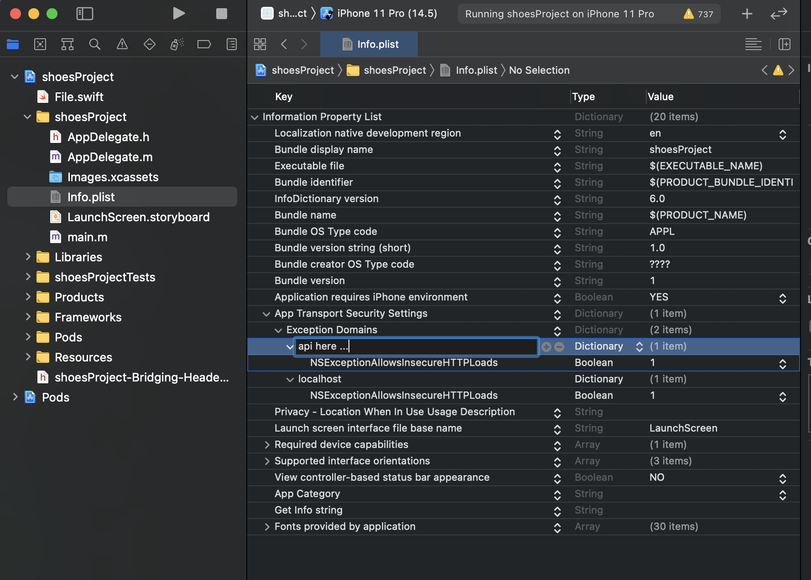

- # CREATE NEW APP
  ```
  - npx react-native init AwesomeProject
  ```
- # CONFIG AND BUILD APP ANDROID
  ```
  - rm -rf ./android/app/src/main/res/raw && rm -rf ./android/app/src/main/res/drawable-*

  - "clean": "cd android && ./gradlew clean && cd ..",

  - "bundle": "react-native bundle --platform android --dev false --entry-file index.js --bundle-output \tandroid/app/src/main/assets/index.android.bundle --assets-dest android/app/src/main/res",

  - "apk:release": "cd android && ./gradlew clean && ./gradlew app:assembleRelease && cd ..",

  - "aab:release": "cd android && ./gradlew clean && ./gradlew bundleRelease && cd ..",

  "pod":"cd ios && rm -rf build/ && arch -x86_64 pod install && cd .. && yarn && yarn ios"

  ```
- # USE PROPS IN CSS

  ```
    const testComponent = (props) => {

      const styles = styleWithProps(props)

      return (...)

    }
    const styleWithProps = (props) =>(

      StyleSheet.create({

        style:{

          backgroundColor:props.color || "#2679f1",

      }}))

    export default testComponent
  ```

- # Gradlew

  -- Error: spawn ./gradlew EACCES

  -- ./gradlew app:installDebug -PreactNativeDevServerPort=8081S

  ---> run at terminal

  ```
  chmod 755 android/gradlew
  ```
- # OPEN METRO BY ITERM2

  -- Open $PROJECT/node_modules/react-native/scripts/launchPackager.command

  -- Right click launchPackager.command

  -- Get Infor -> openWidth -> ITERM 2
- # FIX ERR FLIPPER
  ```
  use_flipper!({ 'Flipper-Folly' => '2.5.3', 'Flipper' => '0.87.0', 'Flipper-RSocket' => '1.3.1' })
   post_install do |installer|
     react_native_post_install(installer)
     installer.pods_project.build_configurations.each do |config|
        config.build_settings["EXCLUDED_ARCHS[sdk=iphonesimulator*]"] = "arm64"
          end
   end
  ```

  ```
    use_flipper!({ 'Flipper' => '0.95.0', 'Flipper-Folly' => '2.6.7', 'Flipper-RSocket' => '1.4.3', 'Flipper-DoubleConversion' => '3.1.7', 'Flipper-Glog' => '0.3.9', 'Flipper-PeerTalk' => '0.0.4' })

    post_install do |installer|
      react_native_post_install(installer)

      installer.pods_project.build_configurations.each do |config|
        config.build_settings['EXCLUDED_ARCHS[sdk=iphonesimulator*]'] = 'arm64'
        config.build_settings["ONLY_ACTIVE_ARCH"] = "YES"
      end

      # attempt to add arm64 to app project
      projects = installer.aggregate_targets
      .map{ |t| t.user_project }
      .uniq{ |p| p.path }
      .push(installer.pods_project)

      arm_value = `/usr/sbin/sysctl -n hw.optional.arm64 2>&1`.to_i

      projects.each do |project|
        project.build_configurations.each do |config|
          if arm_value == 1 then
            config.build_settings["EXCLUDED_ARCHS[sdk=iphonesimulator*]"] = "arm64"
          end
        end

        project.save()
      end
    end
  end
  ```

- # CHANGE FONT

  -- coppy font to foldel src

  -- creat react-native.config.js and
    ```
      module.exports = {
        assets: ['./src/assets/fonts/'],
      };
    ```

  -- react-native link

  -- success -> check xcode, project -> Resources

  -- rebuild project

- # FIX ERROR NETWORK



